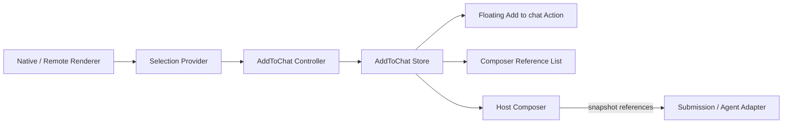

# Add to Chat 插件设计记录

> 状态：设计草案，尚未实现  
> 记录日期：2026-09-21  
> 依据：`CHAT_TURN_NAVIGATION_DESIGN.md` 的可选 View 插件、Controller、Store、Adapter 与宿主边界。

## 1. 结论

Add to Chat 应实现为独立的可选 View 插件，不进入 Chat Runtime Core，也不由具体 Message Card、Agent Adapter 或 Composer 持有核心逻辑。

推荐边界：

- Runtime 继续只负责 `Turn / Branch / Message / lifecycle`。
- 插件负责当前 selection、已添加 reference、浮动操作和引用列表。
- 宿主决定 reference 如何进入 Submission，以及何时清空。
- 应用启动时调用一次 `registerAddToChat()`；插件宿主通过 DOM Adapter 观察现有聊天区域，不包裹 Runtime 或消息内容。
- 远程 Renderer、Web Component 和 Worker 通过统一 selection/reference 协议接入，不依赖 React 组件。
- 插件不直接调用 Agent、不操作 Message Queue、不修改输入框文本。



## 2. 不进入 Runtime Core

该功能不应修改：

- `ChatRuntimeSnapshot`
- `ChatTurn`
- `ChatBranch`
- `BranchMessageHub`
- `FrameSlot`
- `RuntimeFocusController`
- `SubmissionQueue` 内部实现
- WebSocket/SSE Agent Adapter 协议

原因：选区和待发送引用属于 Composer/View 状态，不是已经发生的对话事实。用户可以添加、删除或取消引用，这些操作不应产生 Turn 或 Message。

## 3. 目录结构

与当前已实现的 Chat Turn Navigation 插件保持一致：

```text
src/core/chat/plugins/add-to-chat/
  contracts.ts
  AddToChatViewStore.ts
  createAddToChatController.ts
  registerAddToChat.ts
  AddToChatAction.tsx
  AddToChatReferenceList.tsx
  createDomSelectionAdapter.ts
  styles.css
  index.ts
```

如果未来拆包，可发布为：

```text
@chat-runtime/add-to-chat
```

不放入 `src/core/react`。Core React 组件不应该知道 Add to Chat 的产品语义。

## 4. 数据协议

### 4.1 临时选区

Selection 是尚未添加的瞬时 View 状态：

```ts
export interface AddToChatSelection {
  readonly text: string;
  readonly source: ContextReferenceSource;
  readonly anchor?: AddToChatAnchor;
}

export interface AddToChatAnchor {
  readonly x: number;
  readonly y: number;
}
```

`anchor` 只用于宿主定位浮动按钮，不进入 Submission，也不持久化。

### 4.2 已添加引用

用户点击 Add to chat 后，Selection 转换为稳定、可序列化的 `ContextReference`：

```ts
export interface ContextReference {
  readonly id: string;
  readonly type: "text-selection";
  readonly text: string;
  readonly source: ContextReferenceSource;
  readonly metadata?: Readonly<Record<string, unknown>>;
}

export interface ContextReferenceSource {
  readonly type: string;
  readonly title?: string;
  readonly messageId?: string;
  readonly turnId?: string;
  readonly branchId?: string;
  readonly pluginId?: string;
  readonly targetId?: string;
}
```

约束：

- Reference 必须可序列化。
- 不保存 `Range`、`HTMLElement`、React state 或函数。
- `id` 在添加时生成，不能使用数组索引。
- 相同文本可以被添加多次，每一次都是独立数据源。
- 插件不解释 `metadata`，只负责保留和转交。

## 5. Store 与 Controller

选区属于插件内部的瞬时 View 状态；已添加 references 由宿主 Store 提供。两者不混在一起：

```ts
export interface AddToChatViewSnapshot {
  readonly selection?: AddToChatSelection;
}

export class AddToChatViewStore {
  subscribe(listener: () => void): () => void;
  getSnapshot(): AddToChatViewSnapshot;

  setSelection(selection?: AddToChatSelection): void;
  reset(): void;
}

export interface ContextReferenceStore {
  subscribe(listener: () => void): () => void;
  getSnapshot(): readonly ContextReference[];
  add(reference: ContextReference): void;
  remove(id: string): void;
  clear(): void;
}
```

Controller 由注册函数内部创建，不向业务 React 组件暴露生命周期：

```ts
export interface AddToChatController {
  setSelection(selection?: AddToChatSelection): void;
  addSelection(): void;
  removeReference(id: string): void;
  clearReferences(): void;
  getReferences(): readonly ContextReference[];
}

export function createAddToChatController(options: {
  references: ContextReferenceStore;
}): AddToChatController;
```

一个 Composer/Runtime 实例对应一个 Controller。不要使用进程级或模块级全局 Store，以免多个聊天窗口串数据。

## 6. View 插件

### 6.1 主入口：`registerAddToChat()`

主入口不依赖 React，也不要求修改 JSX。应用入口注册一次即可：

```ts
import { registerAddToChat } from "@chat-runtime/add-to-chat";
import { chatPluginRegistry } from "./chatPluginRegistry";

registerAddToChat({
  registry: chatPluginRegistry,
  id: "main-chat-add-to-chat",
  selectionRoot: ".crt-runtime",
  referenceHost: "[data-chat-reference-host]",
  references: referencesStore,
  resolveSource: ({ startElement }) => ({
    type: "chat-message",
    messageId: startElement
      .closest("[data-message-id]")
      ?.getAttribute("data-message-id") ?? undefined,
  }),
});
```

`referencesStore` 是宿主提供的数据接口，既可以使用普通外部 Store，也可以适配 Runtime KeyValue。注册 API 只消费 `getSnapshot / subscribe / add / remove / clear`，不规定数据存在哪里。

注册之后，插件宿主负责：

- 等待 `selectionRoot` 和 `referenceHost` 出现在 DOM 中。
- Runtime 或 Composer 重挂载后重新绑定。
- 创建和销毁 Controller、监听器及 Portal。
- 同一个 `id` 再次注册时原子替换旧配置，支持 HMR。
- Registry、应用或动态插件销毁时自动清理。

业务页面不调用 `mount()`、`dispose()` 或 `useEffect()`。只 import 模块不会产生副作用；不调用 `registerAddToChat()` 时功能完全不存在。

如果希望做到纯副作用 import，可以由业务项目建立自己的注册模块：

```ts
// features/add-to-chat.register.ts
registerAddToChat({ /* application config */ });

// application bootstrap
import "./features/add-to-chat.register";
```

库本身不能在 import 时自动注册，因为它不知道当前应用的聊天根节点、Composer 插槽和数据源映射。

### 6.2 DOM Selection Adapter

Adapter 接收现有 DOM 节点，不要求业务 Renderer 使用任何 Add to Chat React 组件：

```ts
export interface AddToChatSelectionAdapter {
  getSelectionRoot(): HTMLElement | null;
  getReferenceHost(): HTMLElement | null;
  getOverlayHost?(): HTMLElement | null;
  resolveSource(context: {
    range: Range;
    startElement: Element;
    endElement: Element;
  }): ContextReferenceSource | null;
}
```

默认实现由 `createDomSelectionAdapter()` 提供。插件在 `selectionRoot` 上使用事件委托，读取浏览器 Selection，并且只接受起点和终点都位于该 root 内的选区。来源可通过现有的 `data-message-id`、`data-turn-id`、`data-branch-id` 等稳定属性解析，也可完全由业务传入 `resolveSource`。

Adapter 的职责包括：

- 限定插件可读取的 DOM 范围。
- 把现有 DOM 映射为公共 `ContextReferenceSource`。
- 提供现有的引用列表挂载点和可选浮层挂载点。
- 销毁时移除 selection、pointer、keyboard 和 resize/scroll 监听。

Adapter 不改变这些 DOM 节点的层级，也不持有 Runtime 内部对象。

### 6.3 浮动 Action

插件实例只创建一个共享 Action。它订阅当前 selection：

- 没有 selection 时不渲染。
- 使用 selection anchor 定位。
- 点击时调用 `controller.addSelection()`。
- 通过 Portal 挂载到 overlay host；未提供时挂载到 `document.body`。
- 支持键盘 Focus、Escape 和 `prefers-reduced-motion`。

不能让每个 Message Card 各自创建按钮或 Portal。

### 6.4 Composer Reference List

插件实例把 Reference List 通过 Portal 渲染到 `getReferenceHost()` 返回的现有节点。列表负责：

- 在输入框上方渲染每个数据源。
- 使用稳定的 `reference.id` 作为 key。
- 每条引用独立删除。
- 新引用追加，不覆盖旧引用。
- 不修改 input value。
- 不直接发送消息。

## 7. 宿主接入

```tsx
// ChatPage.tsx：没有 Add to Chat import、组件或 effect。
export function ChatPage() {
  return (
    <ChatLayout>
      <ChatRuntimeView runtime={runtime} renderer={renderer} />

      <Composer>
        <div data-chat-reference-host />
        <ComposerInput />
      </Composer>
    </ChatLayout>
  );
}
```

`ChatRuntimeView` 已经提供 `.crt-runtime` 根节点。Composer 只需提供一个通用 extension slot；它不 import Add to Chat，也不被 Add to Chat 包裹。注册函数通过 selector 或 Adapter 找到这些现有节点。

发送链路通过独立的 references 数据接口读取快照：

```ts
const references = referencesStore.getSnapshot();

await enqueue({
  text: input,
  contextReferences: references,
});

referencesStore.clear();
```

清理策略由宿主决定：

- 成功进入发送队列后清空。
- 入队失败时保留。
- 用户切换 Thread 时 reset 或切换对应 Controller。
- 用户删除单条引用时只影响 Composer 状态。

Submission 必须复制 reference 快照。入队之后继续修改 Store，不能改变已经排队的请求。

## 8. Agent Adapter 边界

插件不规定 DeepSeek 或其他 Agent 的请求格式。业务 Adapter 显式投影：

```ts
function toAgentInput(submission: ChatSubmission): AgentInput {
  return {
    message: submission.text,
    context: {
      references: submission.contextReferences,
    },
  };
}
```

必须增加端到端验证，确认 reference 没有在以下任何一层被丢弃：

```text
Composer
→ SubmissionQueue item
→ Runtime queue target
→ Agent input
→ WebSocket/SSE request
→ Backend model context
```

## 9. 第三方 Renderer 接入

第三方能力分为两类。

### 9.1 同宿主 React Renderer

第三方 React Renderer 不需要 import Add to Chat，也不需要包裹自身内容。宿主在 `resolveSource` 中读取该 Renderer 已有的稳定 DOM 属性：

```tsx
function OrderDetails({ order }: Props) {
  return <article data-order-id={order.id}>{/* existing content */}</article>;
}

const adapter = createDomSelectionAdapter({
  getSelectionRoot: () => existingWorkbenchElement,
  getReferenceHost: () => existingComposerReferenceSlot,
  resolveSource: ({ startElement }) => ({
    type: "order",
    targetId: startElement
      .closest("[data-order-id]")
      ?.getAttribute("data-order-id") ?? undefined,
  }),
});
```

如果 Renderer 连稳定属性也不能增加，业务可以在 `resolveSource` 中使用自身已有 DOM 到业务 ID 的映射。这个适配逻辑属于宿主，不进入 Renderer。

### 9.2 远程或非 React Renderer

远程 ESM、Web Component、Vue、Svelte 或 Worker 不导入宿主 React 组件。它们通过 scoped Plugin API 上报统一 Selection：

```ts
interface RendererSelectionAPI {
  setSelection(selection: AddToChatSelection | null): void;
}
```

或者由 Renderer Handle 暴露：

```ts
interface WorkbenchRendererHandle {
  getSelection?(): AddToChatSelection | null;
  subscribeSelection?(
    listener: (selection: AddToChatSelection | null) => void,
  ): () => void;
  dispose(): void;
}
```

宿主把这些 selection 统一接入同一个 AddToChat Controller。浮动 Action、Reference List 和发送链路只实现一次。

## 10. 与 Chat Turn Navigation 一致的设计原则

| Chat Turn Navigation | Add to Chat |
| --- | --- |
| Runtime 投影 NavigationItem | Renderer 投影 ContextReference |
| NavigationStore | AddToChatViewStore + 宿主 ContextReferenceStore |
| `useChatTurnNavigation()` | `registerAddToChat()` |
| `ChatViewportAdapter` | `AddToChatSelectionAdapter` |
| `ChatTurnNavigationRail` | Registry 托管的 Add to Chat View |
| Runtime 不处理滚动 | Runtime 不处理 selection/context draft |
| 业务提供 Preview | 业务提供 Reference source/metadata |

共同原则：

- 插件是可选 View Enhancement。
- Runtime Core 零改动。
- Store 和 Controller 有明确生命周期。
- 业务数据通过公共契约投影。
- 宿主拥有 Portal、Composer 和发送流程。
- 第三方不取得 Runtime 内部对象。

## 11. Accessibility 与交互

- Action 使用原生 `button`。
- 按钮文案和 `aria-label` 明确说明添加的是当前选区。
- Reference 删除按钮包含数据源序号或标题。
- 键盘选区同样可以触发 Action。
- Escape 只关闭当前 selection，不删除已添加 references。
- 点击 Add 后清理浏览器原生选区。
- Action 不进入 transcript 的 ArrowUp/ArrowDown 焦点状态机。
- Portal 应挂在宿主 overlay root，避免被消息区域 `overflow` 截断。

## 12. 性能与清理

必须满足：

1. 页面只挂载一个共享浮动 Action。
2. 每个 Controller 只拥有一个 Store。
3. Streaming token 不重建已添加 references。
4. Selection 几何更新按 animation frame 合并。
5. Adapter root 变化或插件卸载时撤销临时 selection。
6. Controller 销毁时清理事件监听、frame 和 subscriptions。
7. Store 不持有 DOM 引用。
8. Reference List 使用稳定 ID，不使用数组 offset 作为身份。

## 13. 第一阶段范围

第一版实现：

- `ContextReference` 和 Selection contracts。
- `AddToChatViewStore` 和 `ContextReferenceStore` 接口。
- 内部 `AddToChatController`。
- DOM Selection Adapter。
- 框架无关、应用启动时调用一次的 `registerAddToChat()`。
- Capability Registry 托管的替换与销毁生命周期。
- 通过 Portal 渲染的单例浮动 Action 和 Composer Reference List。
- 多引用追加和独立删除。
- 宿主 Submission reference 快照。
- 一个原生聊天 Renderer 示例。
- Store、Adapter、Plugin、列表和发送投影测试。

第一版不实现：

- 远程 ESM loader。
- iframe selection 桥接。
- 跨多个 selection root 的选区。
- Reference 持久化和跨会话恢复。
- 自动摘要或 token 截断。
- Agent 特定的 prompt 拼接规则。

## 14. 验收标准

1. 未安装/未挂载插件时，Chat Runtime 行为完全不变。
2. 一个页面存在多个 Runtime 时，references 不串数据。
3. 添加两次 selection 后出现两个独立 reference。
4. 删除一项不影响其余 reference，也不修改输入框。
5. Reference 可以携带稳定的 message/turn/branch/plugin source。
6. Submission 获取不可变 reference 快照。
7. 入队失败保留 references，成功入队后宿主可以清空。
8. Agent 请求端能观察到完整 references，不能只停留在 Demo UI。
9. 第三方 Renderer 可以只通过 selection 协议接入，不依赖 React。
10. 插件销毁后不存在 document listener、Portal 或 Store subscription 泄漏。
11. 插件不作为 `ChatRuntimeView`、消息内容或 Composer 的父组件，不改变现有内容树层级。
12. 未调用 `registerAddToChat()` 时，页面没有该功能及任何相关副作用。
13. React 页面不渲染 Add to Chat JSX，也不包含 Add to Chat `useEffect()`。
14. 使用同一注册 `id` 重复执行时不产生重复监听、按钮或引用列表。
