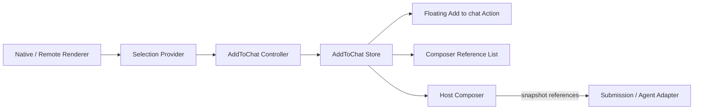

# Add to Chat 插件设计记录

> 状态：设计草案，尚未实现  
> 记录日期：2026-09-21  
> 依据：`CHAT_TURN_NAVIGATION_DESIGN.md` 的可选 View 插件、Controller、Store、Adapter 与宿主边界。

## 1. 结论

Add to Chat 应实现为独立的可选 View 插件，不进入 Chat Runtime Core，也不由具体 Message Card、Agent Adapter 或 Composer 持有核心逻辑。

推荐边界：

- Runtime 继续只负责 `Turn / Branch / Message / lifecycle`。
- 插件负责当前 selection、已添加 reference、浮动操作和引用列表。
- 宿主决定 reference 如何进入 Submission，以及何时清空。
- 本地 React Renderer 可以使用插件提供的 Selection Boundary。
- 远程 Renderer、Web Component 和 Worker 通过统一 selection/reference 协议接入，不依赖 React 组件。
- 插件不直接调用 Agent、不操作 Message Queue、不修改输入框文本。



## 2. 不进入 Runtime Core

该功能不应修改：

- `ChatRuntimeSnapshot`
- `ChatTurn`
- `ChatBranch`
- `BranchMessageHub`
- `FrameSlot`
- `RuntimeFocusController`
- `SubmissionQueue` 内部实现
- WebSocket/SSE Agent Adapter 协议

原因：选区和待发送引用属于 Composer/View 状态，不是已经发生的对话事实。用户可以添加、删除或取消引用，这些操作不应产生 Turn 或 Message。

## 3. 目录结构

与当前已实现的 Chat Turn Navigation 插件保持一致：

```text
src/core/chat/plugins/add-to-chat/
  contracts.ts
  AddToChatStore.ts
  useAddToChat.ts
  AddToChatSelectionBoundary.tsx
  AddToChatAction.tsx
  AddToChatReferenceList.tsx
  createHostSelectionProvider.ts
  styles.css
  index.ts
```

如果未来拆包，可发布为：

```text
@chat-runtime/add-to-chat
```

不放入 `src/core/react`。Core React 组件不应该知道 Add to Chat 的产品语义。

## 4. 数据协议

### 4.1 临时选区

Selection 是尚未添加的瞬时 View 状态：

```ts
export interface AddToChatSelection {
  readonly text: string;
  readonly source: ContextReferenceSource;
  readonly anchor?: AddToChatAnchor;
}

export interface AddToChatAnchor {
  readonly x: number;
  readonly y: number;
}
```

`anchor` 只用于宿主定位浮动按钮，不进入 Submission，也不持久化。

### 4.2 已添加引用

用户点击 Add to chat 后，Selection 转换为稳定、可序列化的 `ContextReference`：

```ts
export interface ContextReference {
  readonly id: string;
  readonly type: "text-selection";
  readonly text: string;
  readonly source: ContextReferenceSource;
  readonly metadata?: Readonly<Record<string, unknown>>;
}

export interface ContextReferenceSource {
  readonly type: string;
  readonly title?: string;
  readonly messageId?: string;
  readonly turnId?: string;
  readonly branchId?: string;
  readonly pluginId?: string;
  readonly targetId?: string;
}
```

约束：

- Reference 必须可序列化。
- 不保存 `Range`、`HTMLElement`、React state 或函数。
- `id` 在添加时生成，不能使用数组索引。
- 相同文本可以被添加多次，每一次都是独立数据源。
- 插件不解释 `metadata`，只负责保留和转交。

## 5. Store 与 Controller

参照 `ChatTurnNavigationStore`，Add to Chat 使用独立外部 Store：

```ts
export interface AddToChatSnapshot {
  readonly selection?: AddToChatSelection;
  readonly references: readonly ContextReference[];
}

export class AddToChatStore {
  subscribe(listener: () => void): () => void;
  getSnapshot(): AddToChatSnapshot;

  setSelection(selection?: AddToChatSelection): void;
  addSelection(): ContextReference | undefined;
  removeReference(id: string): void;
  clearReferences(): void;
  reset(): void;
}
```

React Hook 只负责创建并保持 Controller 生命周期：

```ts
export interface AddToChatController {
  readonly store: AddToChatStore;

  setSelection(selection?: AddToChatSelection): void;
  addSelection(): void;
  removeReference(id: string): void;
  clearReferences(): void;
  getReferences(): readonly ContextReference[];
}

export function useAddToChat(): AddToChatController;
```

一个 Composer/Runtime 实例对应一个 Controller。不要使用进程级或模块级全局 Store，以免多个聊天窗口串数据。

## 6. View 组件

### 6.1 Selection Boundary

本地 React Renderer 可以显式声明可选择区域及来源：

```tsx
<AddToChatSelectionBoundary
  controller={addToChat}
  source={{
    type: "chat-message",
    messageId: message.id,
    turnId: context.turnId,
    branchId: context.branchId,
  }}
>
  <MarkdownMessage content={content} />
</AddToChatSelectionBoundary>
```

Boundary 的职责仅包括：

- 读取自身区域内的浏览器文本选区。
- 转换成 `AddToChatSelection`。
- 把瞬时 selection 交给 Controller。
- 选区清空或 Boundary 卸载时撤销自己的 selection。

Boundary 不渲染浮动按钮、不保存已添加引用、不访问 Composer。

### 6.2 浮动 Action

宿主只挂载一个共享 Action：

```tsx
<AddToChatAction controller={addToChat} />
```

它订阅 Store 中当前 selection：

- 没有 selection 时不渲染。
- 使用 selection anchor 定位。
- 点击时调用 `controller.addSelection()`。
- 通过 Portal 挂载到宿主 overlay root。
- 支持键盘 Focus、Escape 和 `prefers-reduced-motion`。

不能让每个 Message Card 各自创建一个 Portal 按钮。

### 6.3 Composer Reference List

```tsx
<AddToChatReferenceList controller={addToChat} />
```

列表订阅 `references`，负责：

- 在输入框上方渲染每个数据源。
- 使用稳定的 `reference.id` 作为 key。
- 每条引用独立删除。
- 新引用追加，不覆盖旧引用。
- 不修改 input value。
- 不直接发送消息。

## 7. 宿主接入

```tsx
function ChatShell() {
  const addToChat = useAddToChat();

  const send = async () => {
    const references = addToChat.getReferences();

    await enqueue({
      text: input,
      contextReferences: references,
    });

    addToChat.clearReferences();
  };

  return (
    <>
      <AddToChatAction controller={addToChat} />

      <ChatRuntimeView
        runtime={runtime}
        renderer={renderer}
      />

      <Composer>
        <AddToChatReferenceList controller={addToChat} />
        <ComposerInput value={input} />
      </Composer>
    </>
  );
}
```

清理策略由宿主决定：

- 成功进入发送队列后清空。
- 入队失败时保留。
- 用户切换 Thread 时 reset 或切换对应 Controller。
- 用户删除单条引用时只影响 Composer 状态。

Submission 必须复制 reference 快照。入队之后继续修改 Store，不能改变已经排队的请求。

## 8. Agent Adapter 边界

插件不规定 DeepSeek 或其他 Agent 的请求格式。业务 Adapter 显式投影：

```ts
function toAgentInput(submission: ChatSubmission): AgentInput {
  return {
    message: submission.text,
    context: {
      references: submission.contextReferences,
    },
  };
}
```

必须增加端到端验证，确认 reference 没有在以下任何一层被丢弃：

```text
Composer
→ SubmissionQueue item
→ Runtime queue target
→ Agent input
→ WebSocket/SSE request
→ Backend model context
```

## 9. 第三方 Renderer 接入

第三方能力分为两类。

### 9.1 同宿主 React Renderer

可信且与宿主共同构建的 React Renderer 可以使用 Selection Boundary：

```tsx
<AddToChatSelectionBoundary
  controller={controller}
  source={{ type: "order", targetId: order.id }}
>
  <OrderDetails order={order} />
</AddToChatSelectionBoundary>
```

### 9.2 远程或非 React Renderer

远程 ESM、Web Component、Vue、Svelte 或 Worker 不导入宿主 React 组件。它们通过 scoped Plugin API 上报统一 Selection：

```ts
interface RendererSelectionAPI {
  setSelection(selection: AddToChatSelection | null): void;
}
```

或者由 Renderer Handle 暴露：

```ts
interface WorkbenchRendererHandle {
  getSelection?(): AddToChatSelection | null;
  subscribeSelection?(
    listener: (selection: AddToChatSelection | null) => void,
  ): () => void;
  dispose(): void;
}
```

宿主把这些 selection 统一接入同一个 AddToChat Controller。浮动 Action、Reference List 和发送链路只实现一次。

## 10. 与 Chat Turn Navigation 一致的设计原则

| Chat Turn Navigation | Add to Chat |
| --- | --- |
| Runtime 投影 NavigationItem | Renderer 投影 ContextReference |
| NavigationStore | AddToChatStore |
| `useChatTurnNavigation()` | `useAddToChat()` |
| `ChatViewportAdapter` | Selection Provider/Adapter |
| `ChatTurnNavigationRail` | `AddToChatAction` + Reference List |
| Runtime 不处理滚动 | Runtime 不处理 selection/context draft |
| 业务提供 Preview | 业务提供 Reference source/metadata |

共同原则：

- 插件是可选 View Enhancement。
- Runtime Core 零改动。
- Store 和 Controller 有明确生命周期。
- 业务数据通过公共契约投影。
- 宿主拥有 Portal、Composer 和发送流程。
- 第三方不取得 Runtime 内部对象。

## 11. Accessibility 与交互

- Action 使用原生 `button`。
- 按钮文案和 `aria-label` 明确说明添加的是当前选区。
- Reference 删除按钮包含数据源序号或标题。
- 键盘选区同样可以触发 Action。
- Escape 只关闭当前 selection，不删除已添加 references。
- 点击 Add 后清理浏览器原生选区。
- Action 不进入 transcript 的 ArrowUp/ArrowDown 焦点状态机。
- Portal 应挂在宿主 overlay root，避免被消息区域 `overflow` 截断。

## 12. 性能与清理

必须满足：

1. 页面只挂载一个共享浮动 Action。
2. 每个 Controller 只拥有一个 Store。
3. Streaming token 不重建已添加 references。
4. Selection 几何更新按 animation frame 合并。
5. Boundary 卸载时撤销由自己产生的临时 selection。
6. Controller 销毁时清理事件监听、frame 和 subscriptions。
7. Store 不持有 DOM 引用。
8. Reference List 使用稳定 ID，不使用数组 offset 作为身份。

## 13. 第一阶段范围

第一版实现：

- `ContextReference` 和 Selection contracts。
- `AddToChatStore`。
- `useAddToChat()` Controller。
- React Selection Boundary。
- 单例浮动 Action。
- Composer Reference List。
- 多引用追加和独立删除。
- 宿主 Submission reference 快照。
- 一个原生聊天 Renderer 示例。
- Store、Boundary、Action、列表和发送投影测试。

第一版不实现：

- 远程 ESM loader。
- iframe selection 桥接。
- 跨多个 DOM Boundary 的选区。
- Reference 持久化和跨会话恢复。
- 自动摘要或 token 截断。
- Agent 特定的 prompt 拼接规则。

## 14. 验收标准

1. 未安装/未挂载插件时，Chat Runtime 行为完全不变。
2. 一个页面存在多个 Runtime 时，references 不串数据。
3. 添加两次 selection 后出现两个独立 reference。
4. 删除一项不影响其余 reference，也不修改输入框。
5. Reference 可以携带稳定的 message/turn/branch/plugin source。
6. Submission 获取不可变 reference 快照。
7. 入队失败保留 references，成功入队后宿主可以清空。
8. Agent 请求端能观察到完整 references，不能只停留在 Demo UI。
9. 第三方 Renderer 可以只通过 selection 协议接入，不依赖 React。
10. 插件销毁后不存在 document listener、Portal 或 Store subscription 泄漏。
