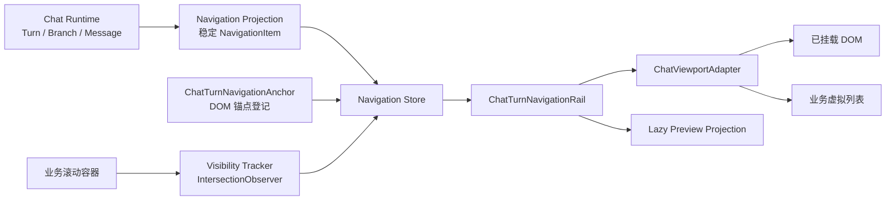

# Chat Turn Navigation 插件设计记录

> 状态：设计草案，尚未实现  
> 记录日期：2026-07-18  
> 目标：记录类似 Codex Desktop 左侧“用户消息导航轨 + 悬浮预览”的结构、行为和后续接入方案。

## 1. 结论

这个能力应该实现为独立的 View 插件，而不是 Chat Runtime 的组成部分。

推荐的边界如下：

- Runtime 继续只负责 `Turn / Branch / Message / lifecycle`。
- 插件从 Runtime 投影出稳定的用户 Turn 导航项。
- `ChatTurnNavigationAnchor` 只负责登记用户消息对应的 DOM 锚点。
- `ChatTurnNavigationRail` 负责导航轨、悬浮预览、点击跳转和拖动浏览。
- 滚动容器和虚拟列表通过 `ChatViewportAdapter` 接入。
- 不修改 `BranchMessageHub`、`FrameSlot`、AG-UI 生命周期或现有 accessibility 状态机。

第一版可以做到 Core Runtime 零改动，直接利用当前已有的：

- `ChatRuntimeSnapshot.turnIds`
- `ChatRuntimeSnapshot.turnsById`
- `ChatTurn.inputMessage`
- `ChatTurn.selectedBranchId`
- `TurnView` 的稳定 `turnId`
- `renderInput` 中的 `context.turnId`



## 2. Codex 功能的实际形态

截图左侧的内容并不是按照整篇聊天高度缩放的传统 minimap，而是一个 User Message Navigation Rail：

- 每个标记对应一条用户消息。
- 标记按照导航顺序排列，不要求与正文高度保持严格比例。
- Hover 或键盘 Focus 时显示轻量预览。
- 点击标记跳转到对应的用户消息。
- 按住并拖过多个标记时，可以快速浏览历史位置。
- 当前视口中可见的用户消息标记会进入 active 状态。

### 2.1 证据边界

OpenAI/Codex 公开仓库当前主要包含 CLI、Rust TUI、app-server、协议和 SDK，没有公开 Codex Desktop 的 React UI 源码。因此：

- 公开仓库可以验证稳定的 Thread、Turn、Item ID 和 Item 生命周期。
- 公开仓库不能直接证明 Desktop 导航轨的 React 组件实现。
- 下文涉及导航轨的具体交互，来自对本机 Codex Desktop 生产产物的只读观察。
- 这些观察用于参考设计，不应被当作 OpenAI 对外承诺的稳定 API。

本次只读观察基于 Codex Desktop `26.715.2305.0` 的以下产物：

- `thread-user-message-navigation-rail-CV98s9Os.js`
- `thread-user-message-navigation-rail-CZzXjFhl.css`
- `local-conversation-thread-DW_tok9_.js`
- `thread-scroll-layout-B6SRazaH.js`
- `thread-virtualizer-43g3Bw27.js`

公开仓库参考：

- [ThreadItem 与 UserMessage](https://github.com/openai/codex/blob/56395bddaf26eb2829387ca6a417bf9128e5b239/codex-rs/app-server-protocol/src/protocol/v2/item.rs#L223-L250)
- [Thread、Turn、状态和时间数据](https://github.com/openai/codex/blob/56395bddaf26eb2829387ca6a417bf9128e5b239/codex-rs/app-server-protocol/src/protocol/v2/thread_data.rs#L167-L267)
- [Item started/delta/completed 生命周期](https://github.com/openai/codex/blob/56395bddaf26eb2829387ca6a417bf9128e5b239/codex-rs/app-server/README.md#L1406-L1455)
- [Thread 历史加载](https://github.com/openai/codex/blob/56395bddaf26eb2829387ca6a417bf9128e5b239/codex-rs/app-server/README.md#L493-L510)

### 2.2 观察到的导航项模型

生产产物中的数据结构可以概括为：

```ts
interface NavigationItem {
  id: string;
  turnKey: string;
  isHeartbeat: boolean;
  getLabel(): string;
  getPreview(): {
    response: string;
    outputs: Array<{
      type:
        | "app"
        | "commit"
        | "file"
        | "google-drive"
        | "image"
        | "pull-request"
        | "review"
        | "website";
      label?: string;
    }>;
  };
}
```

需要关注的设计点：

- `id` 和 `turnKey` 稳定，不使用数组 offset 作为身份。
- `getLabel()`、`getPreview()` 是惰性读取，不在所有历史项创建时完成复杂投影。
- Tooltip 最多显示三行回答和少量 output badge。
- Tooltip 不会重新挂载正文中的真实 Card。

### 2.3 Mount 与显示策略

观察到的策略包括：

- 导航轨使用动态 import。
- 等待历史数据完整后再启用。
- 优先通过 `requestIdleCallback({ timeout: 2000 })` 延迟加载。
- 不支持 `requestIdleCallback` 时回退到 `setTimeout(0)`。
- 用户消息少于约四项时不显示。
- 左侧可用空间不足约 `48px` 时不显示。
- 通过 Portal 放到滚动容器的相邻 overlay 层。
- 导航轨最大高度受 viewport 限制，项目过多时导航轨自身滚动。

这些行为说明它是可选的 View Enhancement，而不是 Runtime 必需能力。

### 2.4 当前可见项检测

Codex 使用 `IntersectionObserver`，而不是每次 scroll 都读取全部节点的位置：

- observer 的 root 是聊天滚动容器。
- 通过稳定的数据属性找到 Turn/User Message 对应节点。
- 同时可见多个用户消息时，可以形成一段连续的 active marker。
- DOM 结构变化时才重新登记 observer target。
- 不监听 streaming token 引起的 `characterData` 变化。

在我们的实现中，由于有显式的 `ChatTurnNavigationAnchor` registry，第一版甚至不需要依赖全局 `MutationObserver`。

### 2.5 Click、Hover 与 Scrub

观察到的交互：

- 点击已挂载目标时，平滑滚动到目标顶部。
- 跳转结束后，对用户消息做短暂背景 highlight。
- `prefers-reduced-motion` 开启时取消或缩短动画。
- Hover/Focus 时只显示一个共享 Tooltip。
- pointer down 后使用 `setPointerCapture`。
- pointer move 时通过 `elementFromPoint()` 找到经过的 marker。
- Scrub 跨过新 marker 时采用即时跳转，不重复启动平滑动画。
- pointer up、cancel、lost capture 使用同一条 cleanup 路径。
- Scrub 完成后抑制紧随其后的 click，避免重复滚动。

### 2.6 虚拟列表兼容

Rail 本身不负责虚拟化。

目标已经挂载时，直接定位 DOM；目标未挂载时，调用宿主提供的 reveal 方法：

1. 根据 `turnId/turnKey` 请求虚拟列表滚动到目标。
2. 等待目标 Turn 挂载。
3. 获取具体用户消息 Anchor。
4. 完成最终位置修正和 highlight。

这个边界很重要：插件提供导航协议，业务自己的虚拟列表决定如何 reveal item。

## 3. 与当前 Chat Core 的对应关系

### 3.1 当前已经具备的能力

当前 `ChatRuntimeView` 按稳定 `turnId` 渲染 `TurnView`：

```tsx
turnIds.map((turnId) => (
  <TurnView key={turnId} turnId={turnId} />
))
```

当前 `TurnView` 已经提供：

```tsx
<article data-turn-id={turn.id}>
  {turn.inputMessage && renderInput && (...)}
</article>
```

并且 `renderInput` 能拿到：

```ts
props.context.turnId
props.message.id
```

因此导航插件可以按 Turn 建立索引，不需要改动 Runtime 状态机。

### 3.2 不应该使用的边界

`FrameSlot` 不适合作为这个功能的 Anchor：

- `FrameSlot` 是 Core 与 AI Card 之间的边界。
- 用户导航轨索引的是 Turn 的用户输入。
- AI streaming 会持续更新 Frame，而历史导航项不应该跟随更新。

`RuntimeFocusController` 也不应该管理 Rail：

- 它负责 transcript 内消息组的上下键导航。
- Rail 是独立的 `<nav>`。
- Rail 应放在 transcript focus root 外，避免两套 ArrowUp/ArrowDown 语义冲突。

`ChatExtensionStore` 不适合作为插件主 Store：

- 不应在其中保存 `HTMLElement`、Observer 或滚动状态。
- 外部 Rail 未必能取得 `ChatRuntimeView` 内部自动创建的 ExtensionStore。
- 它可以作为可选 metadata bridge，但不是插件生命周期基础。

## 4. 推荐目录结构

建议先作为独立可选模块开发，成熟后可以发布成单独包：

```text
src/plugins/chat-turn-navigation/
  contracts.ts
  NavigationStore.ts
  createRuntimeNavigationSource.ts
  createDomViewportAdapter.ts
  ChatTurnNavigationProvider.tsx
  ChatTurnNavigationAnchor.tsx
  ChatTurnNavigationRail.tsx
  ChatTurnNavigationTooltip.tsx
  styles.css
  index.ts
```

后续如果发布成包，可以使用类似：

```text
@chat-runtime/chat-turn-navigation
```

插件代码不应放在 `src/core/chat/runtime` 下。

## 5. 建议的公共契约

以下只是后续实现建议，不代表当前已经导出的 API。

```ts
import type { Message } from "@ag-ui/client";
import type { ReactNode, RefObject } from "react";
import type {
  ChatBranch,
  ChatRuntime,
  ChatTurn,
} from "../../core/chat";

export interface ChatTurnNavigationPreview {
  title: ReactNode;
  body?: ReactNode;
  outputs?: readonly ChatTurnNavigationOutput[];
  ariaLabel: string;
}

export interface ChatTurnNavigationOutput {
  type: string;
  label?: string;
}

export interface ChatTurnNavigationItem {
  id: string;
  turnId: string;
  messageId: string;
  getLabel(): ReactNode;
  getPreview(): ChatTurnNavigationPreview;
}

export interface ChatTurnNavigationTarget {
  item: ChatTurnNavigationItem;
  element: HTMLElement | null;
}

export interface ChatViewportAdapter {
  getScrollElement(): HTMLElement | null;

  revealItem(
    target: ChatTurnNavigationTarget,
    options: {
      behavior: ScrollBehavior | "instant";
      align: "start" | "center";
    },
  ): void | Promise<void>;
}

export interface ChatTurnNavigationProviderProps<
  TMessage extends Message,
> {
  runtime: ChatRuntime<unknown, TMessage>;
  scrollContainerRef: RefObject<HTMLElement | null>;
  viewportAdapter?: ChatViewportAdapter;
  includeTurn?: (turn: ChatTurn<TMessage>) => boolean;
  getPreview: (context: {
    turn: ChatTurn<TMessage>;
    inputMessage: TMessage;
    selectedBranch?: ChatBranch<TMessage>;
    selectedMessages?: readonly TMessage[];
  }) => ChatTurnNavigationPreview;
  children: ReactNode;
}
```

### 5.1 为什么 Preview 使用回调

Core 不理解业务消息内容，Preview 的文案、图标和 output 类型应该由用户投影：

- 插件负责何时读取和显示。
- 用户负责把 Message 转换为轻量 PreviewModel。
- 不允许直接把真实 User Card 或 AI Card 作为默认 Preview。

## 6. `ChatTurnNavigationAnchor` 设计

### 6.1 职责

Anchor 只做三件事：

1. 提供一个真实、可测量的 DOM 节点。
2. 用稳定 `turnId` 将节点登记到插件 registry。
3. 卸载时安全地取消登记。

Anchor 不应该：

- 订阅 Runtime。
- 订阅 Branch `messageReader`。
- 计算 Preview。
- 处理 scroll。
- 注册为 `RuntimeFocusGroup`。
- 修改 Card key。
- 参与 AG-UI 生命周期。

### 6.2 建议接口

```ts
export interface ChatTurnNavigationAnchorProps {
  turnId: string;
  messageId?: string;
  className?: string;
  children: ReactNode;
}
```

第一版建议固定渲染一个 `div`，不要一开始实现复杂的 polymorphic `asChild` API。

原因：

- Anchor 必须拥有一个真实 box，才能被 `IntersectionObserver` 观察。
- `display: contents` 没有稳定 layout box，不适合作为 observer target。
- clone child/ref merging 会显著增加 StrictMode 和用户组件 ref 的复杂度。

### 6.3 Registry 数据结构

```ts
interface AnchorEntry {
  turnId: string;
  messageId?: string;
  element: HTMLElement;
  token: symbol;
}

class ChatTurnNavigationRegistry {
  private readonly anchors = new Map<string, AnchorEntry>();

  register(entry: AnchorEntry): void;
  unregister(turnId: string, token: symbol): void;
  get(turnId: string): HTMLElement | null;
}
```

`token` 用于处理 React StrictMode 和 ref callback 替换：旧 ref 的 cleanup 不能删除刚刚完成登记的新节点。

### 6.4 建议实现骨架

```tsx
export function ChatTurnNavigationAnchor({
  turnId,
  messageId,
  className,
  children,
}: ChatTurnNavigationAnchorProps) {
  const registry = useChatTurnNavigationRegistry();
  const token = useMemo(() => Symbol(turnId), [turnId]);

  const setElement = useCallback<RefCallback<HTMLDivElement>>(
    (element) => {
      if (element) {
        registry.register({
          turnId,
          messageId,
          element,
          token,
        });
        return;
      }

      registry.unregister(turnId, token);
    },
    [messageId, registry, token, turnId],
  );

  return (
    <div
      ref={setElement}
      className={className}
      data-chat-turn-navigation-anchor={turnId}
      data-chat-turn-navigation-message-id={messageId}
    >
      {children}
    </div>
  );
}
```

实现时还应保证：

- 相同 `turnId + element + token` 的重复登记是幂等的。
- 新 entry 覆盖旧 entry 时，旧 cleanup 不会删除新 entry。
- `turnId` 变化时，旧 Anchor 被正确注销。
- Provider dispose 后，不再向已经销毁的 Store 发布通知。

### 6.5 与现有 `renderInput` 的接入

```tsx
<ChatTurnNavigationProvider
  runtime={runtime}
  scrollContainerRef={viewportRef}
  getPreview={createBusinessPreview}
>
  <div className="chat-shell">
    <div ref={viewportRef} className="chat-viewport">
      <ChatRuntimeView
        runtime={runtime}
        renderer={renderer}
        renderInput={(props) => (
          <ChatTurnNavigationAnchor
            turnId={props.context.turnId}
            messageId={props.message.id}
          >
            <UserCard {...props} />
          </ChatTurnNavigationAnchor>
        )}
      />
    </div>

    <ChatTurnNavigationRail />
  </div>
</ChatTurnNavigationProvider>
```

可以额外提供一个减少样板代码的 helper：

```ts
const renderInput = createNavigableInputRenderer(renderUserCard);
```

但第一版先验证 Anchor 边界，不必过早增加 helper。

## 7. Navigation Projection

### 7.1 订阅范围

Projection 只应该订阅导航拓扑：

```ts
interface NavigationTopology {
  turnIds: readonly string[];
  turnsById: ChatRuntimeSnapshot["turnsById"];
}
```

更精确的实现可以只保留：

- `turnIds`
- 每个 Turn 的对象引用
- `inputMessage` 或 `inputMessage.id`
- `selectedBranchId`，仅当 Preview 策略需要时

不要让导航列表常驻订阅所有历史 Branch `messageReader`。最新 AI 消息 streaming 时，历史 marker 不应该重新渲染。

### 7.2 Item 创建规则

当前 Runtime 是一轮一个可选 `inputMessage`，因此默认规则是：

- 有 `inputMessage`：创建一个导航项。
- AI-only Turn：不创建用户消息导航项。
- User Error Turn：默认创建，可以通过 `includeTurn` 过滤。
- 删除 Error Turn：移除对应 marker，不影响其他 marker 身份。
- AB Turn：仍然只有一个用户 marker，不按 Branch 创建两个 marker。

稳定 ID 建议：

```ts
const itemId = `${turn.id}:${turn.inputMessage.id}`;
```

不要使用：

```ts
const itemId = String(turnIndex);
```

### 7.3 Item 缓存

可使用 `Map<turnId, CacheEntry>` 或 `WeakMap<ChatTurn, NavigationItem>`：

```ts
interface CachedNavigationItem {
  turn: ChatTurn;
  inputMessage: Message;
  item: ChatTurnNavigationItem;
}
```

当 `turn` 和 `inputMessage` 引用未变化时复用 Item，避免 Runtime snapshot 更新造成所有 marker 换引用。

## 8. Preview 读取策略

### 8.1 默认策略

Preview 应该在 Hover/Focus 时惰性读取：

1. 从当前 Runtime snapshot 读取目标 Turn。
2. 读取 `turn.inputMessage` 作为标题。
3. 找到 `selectedBranchId`。
4. 只读取该 Branch 的 `messageReader`。
5. 由用户 `getPreview()` 转换为轻量模型。

### 8.2 Streaming 中的 Preview

默认可以在 Tooltip 打开时读取一次，不要求跟随每个 token 更新。

如果产品要求 Tooltip 展示正在 streaming 的内容：

- 只订阅当前 hovered item 对应的一个 Branch reader。
- Tooltip 关闭后立即退订。
- 高频通知按 animation frame 合并。
- 不允许因此订阅整个历史列表。

### 8.3 AB 模式

AB 模式下一个 Turn 仍然只有一个用户 marker。

Preview 默认展示当前 `selectedBranchId` 的回答。如果尚未选择，推荐二选一：

- 展示“有 N 个回答可供比较”的轻量摘要。
- 由业务 `getPreview` 明确决定展示方式。

不要静默选择第一个 Branch，否则 Preview 与页面的选择状态可能不一致。

## 9. `ChatTurnNavigationRail` 设计

### 9.1 基础结构

```tsx
<nav aria-label="User messages">
  {items.map((item, index) => (
    <button
      key={item.id}
      type="button"
      aria-label={`Jump to user message ${index + 1}`}
      aria-current={activeIds.has(item.id) ? "true" : undefined}
    />
  ))}
</nav>
```

建议：

- 使用原生 button。
- Rail 只创建一个 Tooltip Portal。
- 当前 hovered/focused marker 通过 `aria-describedby` 关联 Tooltip。
- 支持 `focus-visible`。
- 支持 `prefers-reduced-motion`。
- Rail 放在 `RuntimeFocusController` 管理范围之外。

### 9.2 Marker 排列

第一版使用等距 marker，不要按照全文高度比例实时计算位置。

原因：

- streaming 会持续改变正文高度。
- 高度比例 minimap 会导致所有 marker 持续移动。
- 等距用户消息索引更稳定，也更适合快速 scrub。

Marker 较多时：

- Rail 设置最大高度。
- Rail 自身可滚动。
- Active marker 进入视野时仅滚动 Rail，不影响聊天正文。

### 9.3 邻近 Marker 动画

可以使用 CSS `:has()` 完成 hover 邻近放大，避免 JS 在 pointermove 中重算所有邻居：

```css
.marker:has(+ .marker:hover),
.marker:hover + .marker {
  transform: scaleX(1.7);
}
```

实际实现可以扩展到相邻两到三项，但应提供不支持 `:has()` 时的普通样式。

## 10. Visibility Tracker

推荐一个共享 `IntersectionObserver`：

```ts
const observer = new IntersectionObserver(handleEntries, {
  root: viewportAdapter.getScrollElement(),
  rootMargin: "-16px 0px 0px 0px",
  threshold: [0, 0.01],
});
```

Registry 新增或删除 Anchor 时：

- 新增：`observer.observe(element)`。
- 删除：`observer.unobserve(element)`。
- root 改变：重建 observer。
- dispose：`observer.disconnect()`。

不应：

- 每个 marker 创建一个 observer。
- 每次 scroll 遍历所有 Turn 并调用 `getBoundingClientRect()`。
- 监听 streaming 内容的 `characterData` mutation。

## 11. 滚动适配器

### 11.1 普通 DOM 列表

默认 adapter 可以限定在指定 scroll container 内计算位置：

```ts
const containerRect = container.getBoundingClientRect();
const targetRect = element.getBoundingClientRect();
const top =
  container.scrollTop +
  targetRect.top -
  containerRect.top -
  topOffset;

container.scrollTo({ top, behavior: "smooth" });
```

这比无条件调用全局 `element.scrollIntoView()` 更可控，不会意外滚动页面外层容器。

### 11.2 虚拟列表

业务虚拟列表通过自定义 adapter 处理：

```ts
const virtualizedAdapter: ChatViewportAdapter = {
  getScrollElement: () => virtualList.getScrollElement(),
  revealItem: async ({ item, element }, options) => {
    if (element) {
      scrollMountedElement(element, options);
      return;
    }

    await virtualList.scrollToKey(item.turnId, {
      align: options.align,
    });
    await waitForAnchor(item.turnId);
  },
};
```

插件不负责：

- 估算 Turn 高度。
- overscan。
- 历史分页。
- 虚拟列表的 anchor compensation。

### 11.3 与自动跟随最新消息的关系

用户通过 Rail 跳转历史位置时，宿主的“自动跟随最新消息”必须暂停，否则新的 streaming token 会立即把视口重新拉到底部。

这个策略仍由宿主 Scroll Controller 管理。插件可以提供通知：

```ts
onUserNavigate?: (item: ChatTurnNavigationItem) => void;
```

但不应把 follow-latest 状态放进 Chat Runtime。

## 12. 调度与清理

不要使用依赖闭包布尔值的：

```ts
let active = true;
```

优先保存可取消的真实调度句柄：

```ts
function scheduleFrame(callback: FrameRequestCallback) {
  const frameId = requestAnimationFrame(callback);
  return () => cancelAnimationFrame(frameId);
}
```

如果存在 fallback，统一返回 cancel：

```ts
function scheduleVisualUpdate(callback: () => void) {
  if (typeof requestAnimationFrame === "function") {
    const frameId = requestAnimationFrame(() => callback());
    return () => cancelAnimationFrame(frameId);
  }

  const timeoutId = setTimeout(callback, 16);
  return () => clearTimeout(timeoutId);
}
```

事件监听可以使用单个 `AbortController` 集中清理：

```ts
const controller = new AbortController();
element.addEventListener("pointermove", onPointerMove, {
  signal: controller.signal,
});

return () => controller.abort();
```

需要统一清理：

- animation frame / timeout。
- IntersectionObserver。
- ResizeObserver。
- pointer capture。
- Tooltip portal 状态。
- Runtime topology subscription。
- hovered Branch reader subscription。

## 13. 性能约束

必须满足：

1. 所有 marker 共享一次 Runtime topology 订阅。
2. 最新 AI streaming 不重建历史 NavigationItem。
3. Anchor 本身不订阅任何消息数据。
4. Tooltip 不挂载真实业务 Card。
5. 只有 hovered/focused Preview 可以临时读取 Branch messages。
6. 不对整个消息历史做深拷贝。
7. 不在每个 token 后重新测量所有 Turn。
8. DOM 变化优先通过显式 Anchor registry 感知。
9. 几何测量和 Tooltip 跟随位置按 frame 合并。
10. stable key 使用 `turnId/messageId`，不使用 offset。

预期的数据更新范围：

| 事件 | Navigation list | Marker | Tooltip |
| --- | --- | --- | --- |
| 最新 AI token | 不更新 | 不更新 | 仅 hovered live preview 可选更新 |
| 新增 Turn | 追加一个 item | 新增一个 marker | 不更新 |
| 删除 Error Turn | 删除对应 item | 删除对应 marker | 目标被删时关闭 |
| 切换 AB branch | item 身份不变 | 不更新 | 打开时更新 preview |
| 历史 Card 内部 state | 不更新 | 不更新 | 不更新 |
| 用户滚动 | 不更新 items | 更新 active 状态 | 必要时重新定位 |

## 14. Accessibility 约束

- Rail 使用 `<nav aria-label="User messages">`。
- Marker 使用 `<button type="button">`。
- 当前可见 marker 使用 `aria-current="true"`。
- Tooltip 同时支持 hover 和 focus。
- Tooltip 通过 `aria-describedby` 与当前 marker 关联。
- 支持 `prefers-reduced-motion`。
- 不修改 transcript 内现有 roving tab index。
- 不把 marker 注册为 `RuntimeFocusGroup`。
- 如果增加快捷键，应该限定在 Rail 获得焦点时，避免抢占消息列表的上下键。

## 15. 分阶段实施建议

### Phase 1：基础导航

- Navigation contracts。
- Provider 和独立 Store。
- `ChatTurnNavigationAnchor` registry。
- Runtime topology projection。
- 普通 DOM viewport adapter。
- Rail marker 和点击跳转。

### Phase 2：完整交互

- IntersectionObserver active range。
- Hover/Focus Preview。
- Pointer scrub。
- 跳转 highlight。
- reduced motion。
- idle/dynamic mount。
- 窄 gutter 和最少 item 数量判断。

### Phase 3：扩展能力

- 虚拟列表 adapter。
- 历史分页联动。
- AB Preview 策略。
- output badges。
- 可选快捷键。
- 超长导航轨的 marker windowing。

## 16. 回归测试清单

### Anchor

- StrictMode 下重复 mount/unmount 不会误删新 Anchor。
- 相同 Turn 重复登记幂等。
- Turn 删除后 registry 不再返回旧 DOM。
- Anchor 不参与 RuntimeFocusRegistry。

### Projection

- 一个有 User Input 的 Turn 只生成一个 item。
- AB Turn 不按 Branch 重复生成 item。
- AI-only Turn 默认不生成 item。
- User Error Turn 可生成并可通过 filter 排除。
- Error Turn 删除后历史 item identity 保持稳定。

### Streaming 性能

- 最新消息 streaming 时，历史 marker render count 不增加。
- 最新消息 streaming 时，历史 Preview 不被重新计算。
- Tooltip 不会 mount 真实 Card，也不会执行 Card 的 Effect/API。
- 仅 live hovered preview 可以按帧更新。

### Scroll

- 已挂载目标直接跳转。
- 未挂载目标调用 virtualizer adapter。
- 点击导航后通知宿主暂停 follow-latest。
- Scrub 不会在 pointerup 后重复触发 smooth click。
- pointercancel/lostpointercapture 能完整清理。

### Observer 与生命周期

- Anchor 新增后开始 observe。
- Anchor 删除后 unobserve。
- Provider dispose 后 disconnect observer 并取消所有 frame。
- dispose 后不会继续更新 Store。

### Accessibility

- Rail 和 marker 具有正确 role/name。
- active marker 具有 `aria-current`。
- focus marker 时可以读取 Preview。
- reduced motion 下不执行平滑滚动和 highlight 动画。

## 17. 当前不做的内容

本设计不包含：

- 修改 Runtime 状态机。
- 修改 AG-UI 生命周期。
- 修改 `BranchMessageHub`。
- 修改 `FrameSlot`。
- 修改现有 accessibility/InnerFocusManager。
- 内置消息列表虚拟化。
- 管理用户设置的聊天窗口高度。
- 将 Preview、activeTurnId 或 scrollTop 写入 Runtime snapshot。
- 把 DOM element 存进 `ChatExtensionStore`。

## 18. 最终建议

后续开始开发时，先实现最小闭环：

```text
Provider
  + Anchor Registry
  + Runtime Topology Projection
  + DOM Viewport Adapter
  + Rail Click Navigation
```

这一步已经可以验证整体边界是否正确，并且不需要改动 Core。

确认基础闭环稳定后，再加入 Preview、IntersectionObserver、Scrub 和虚拟列表适配。这样可以避免一次性把滚动、观察器、Tooltip、虚拟化和 accessibility 全部耦合在一起。
