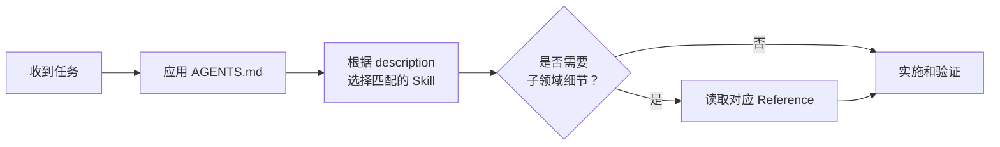

# GPBW Agent 与 Skills 结构说明

这套结构分为三层：常驻规则、按任务触发的 Skills，以及按需读取的 References。

## 1. 整体结构

```mermaid
flowchart TB
    Task["开发任务 / 用户请求"]

    subgraph Always["第一层：常驻规则"]
        Agent["AGENTS.md<br/>仓库事实、通用约束、数据契约、验证和终端规则"]
        Bridge[".github/copilot-instructions.md<br/>引导 Copilot 读取 AGENTS.md 和 Skills"]
    end

    subgraph Skills["第二层：职责型 Skills"]
        subgraph Collaboration["协作方式"]
            Analysis["analysis-first-collaboration<br/>先诊断，再小步修改"]
        end

        subgraph Engineering["工程职责"]
            Design["design-implementation-principles<br/>架构、边界、迁移、多 Owner 设计"]
            Logic["logic-development<br/>业务逻辑、数据契约、校验和 Fallback"]
            UI["ui-development<br/>组件、样式、响应式、布局和滚动"]
            RuntimeDebug["runtime-sensitive-ui-debugging<br/>时序、渲染、流式、闪烁和引用稳定性"]
        end

        subgraph Domain["项目与领域"]
            GPBW["gpbw-project<br/>GPBW 项目入口和应用层约定"]
            Core["core-frame-runtime-design<br/>Core Chat Runtime 子系统"]
        end

        subgraph Delivery["交付流程"]
            PR["pull-request-authoring<br/>PR 标题、正文和验证证据"]
            Branch["target-branch-sync<br/>目标分支同步和冲突处理"]
        end

        subgraph Meta["Skills 治理"]
            SkillDesign["skill-design<br/>创建、修改、拆分、合并和删除 Skills"]
        end
    end

    subgraph References["第三层：按需读取的 References"]
        AppRef["application-conventions<br/>配置、服务、Zustand、i18n"]
        RepoRef["repository-map<br/>目录、Owner 和入口定位"]
        CapabilityRef["capability-registry<br/>能力注册、版本选择和懒加载"]
        ChartRef["chart-data-ui<br/>图表数据、ECharts 生命周期和组件归属"]
        MarkdownRef["markdown-inline-tokens<br/>Markdown Token Pipeline"]

        CoreArchitecture["architecture"]
        CoreRuntime["runtime-and-messages"]
        CoreRendering["rendering"]
        CoreQueue["queue-and-sources"]

        ContractRef["data-contracts<br/>字段保证、边界校验和 Fallback 条件"]

        SkillTemplate["structure-and-templates"]
        SkillChecklist["review-checklist"]
    end

    Task --> Agent
    Task --> Bridge
    Bridge --> Skills

    GPBW --> RepoRef
    GPBW --> AppRef
    GPBW --> CapabilityRef
    GPBW --> ChartRef
    GPBW --> MarkdownRef

    GPBW -.任务路由.-> Logic
    GPBW -.任务路由.-> UI
    GPBW -.复杂设计.-> Design
    GPBW -.Core任务.-> Core

    Core --> CoreArchitecture
    Core --> CoreRuntime
    Core --> CoreRendering
    Core --> CoreQueue

    Logic --> ContractRef

    SkillDesign --> SkillTemplate
    SkillDesign --> SkillChecklist
```



## 2. 目录结构

```text
m_skill/
├── AGENTS.md
│   └── 仓库级常驻规则
│
├── README.md
│   └── Agent 与 Skills 结构说明
│
└── .github/
    ├── copilot-instructions.md
    │   └── Copilot 指令桥接
    ├── copilot-commit-message-instructions.md
    │   └── Commit Message 自动生成规则
    ├── pull_request_template.md
    │   └── GitHub PR 模板
    │
    └── skills/
        ├── analysis-first-collaboration/
        ├── design-implementation-principles/
        ├── logic-development/
        │   └── references/data-contracts.md
        ├── ui-development/
        ├── runtime-sensitive-ui-debugging/
        │
        ├── gpbw-project/
        │   └── references/
        │       ├── repository-map.md
        │       ├── application-conventions.md
        │       ├── capability-registry.md
        │       ├── chart-data-ui.md
        │       └── markdown-inline-tokens.md
        │
        ├── core-frame-runtime-design/
        │   └── references/
        │       ├── architecture.md
        │       ├── runtime-and-messages.md
        │       ├── rendering.md
        │       └── queue-and-sources.md
        │
        ├── pull-request-authoring/
        ├── target-branch-sync/
        │
        └── skill-design/
            └── references/
                ├── structure-and-templates.md
                └── review-checklist.md
```

## 3. Skills 职责

| Skill | 负责什么 | 典型触发场景 | 不负责什么 |
| --- | --- | --- | --- |
| `analysis-first-collaboration` | 先定位现象和原因，再进行小步修改 | 需求还在探索、需要先解释、短反馈循环 | 固定的项目技术规范 |
| `design-implementation-principles` | Owner、架构边界、迁移顺序、多模块设计 | 重构、迁移、新运行时边界、多 Owner 修改 | 已有明确 Owner 的简单局部修改 |
| `logic-development` | 业务规则、字段契约、转换、校验、默认值和 Fallback | 判断字段是否可信、在哪里校验、是否需要兼容处理 | CSS、布局和视觉样式 |
| `ui-development` | 组件结构、样式、设计 Token、响应式、Modal、Overflow 和 Scroll | UI 开发、样式修改、响应式适配、组件复用 | 业务规则和运行时时序问题 |
| `runtime-sensitive-ui-debugging` | 渲染时序、流式更新、闪烁、焦点、滚动和引用稳定性 | 静态代码看似正确，但真实运行异常 | 单纯颜色、间距等视觉问题 |
| `gpbw-project` | 项目级入口、应用层约定和项目领域知识路由 | GPBW 项目中的配置、服务、状态、图表、Markdown、Capability | 通用工程理论或完整 Core Runtime 设计 |
| `core-frame-runtime-design` | Core Chat Runtime 的架构和非显而易见契约 | AG-UI、AnswerSource、MessageReader、Frame、Queue、Scheduler | 普通应用 UI、业务服务代码 |
| `pull-request-authoring` | 根据真实 Diff 生成 PR 标题、说明和验证证据 | 创建或更新 PR | 实现代码 |
| `target-branch-sync` | 同步目标分支、处理冲突、保留目标分支新契约 | `git pull` 冲突、push 前同步、更新 PR | 普通 Commit Message 生成 |
| `skill-design` | Skills 的创建、修改、拆分、合并、审计和删除 | 新增 Skill、清理重复 Skill、调整触发描述和 References | 普通项目文档编写 |

## 4. GPBW Project References

`gpbw-project` 是应用层项目知识入口。以下内容属于项目内的条件知识，没有独立工作流，因此作为 References 按需读取。

| Reference | 内容范围 | 归入 GPBW Project 的原因 |
| --- | --- | --- |
| `repository-map.md` | 目录、入口、Owner、关键业务链路 | 只提供定位信息，没有独立工作流 |
| `application-conventions.md` | Configuration、Service、Zustand、i18n、Runtime UI State | 属于应用层项目约定 |
| `capability-registry.md` | 注册、版本、Market、Lazy Proxy、Decorator | 是 GPBW 项目内的特定子系统知识 |
| `chart-data-ui.md` | Chart Service、ECharts 生命周期、Tooltip、组件归属 | 主要是项目已有实现和路径约定 |
| `markdown-inline-tokens.md` | YAML Matcher、Transform Registry、Token Renderer | 是项目内部 Markdown Pipeline 的条件知识 |

## 5. 任务路由方式



## 6. 文件职责原则

> `AGENTS.md` 管长期有效的仓库约束；`SKILL.md` 管一种明确职责和决策流程；`references/` 管只有进入具体子领域时才需要读取的详细知识。

- 仓库级、几乎每次任务都需要遵守的约束放在 `AGENTS.md`。
- 能通过请求内容独立触发的工作职责放在独立 `SKILL.md`。
- 没有独立工作流，只在特定领域下使用的详细知识放在父 Skill 的 `references/`。
- Skill 只保留触发条件、核心决策、流程和 Reference 路由。
- 不重复描述模型已有的通用能力，不添加角色设定或无法执行的抽象原则。
